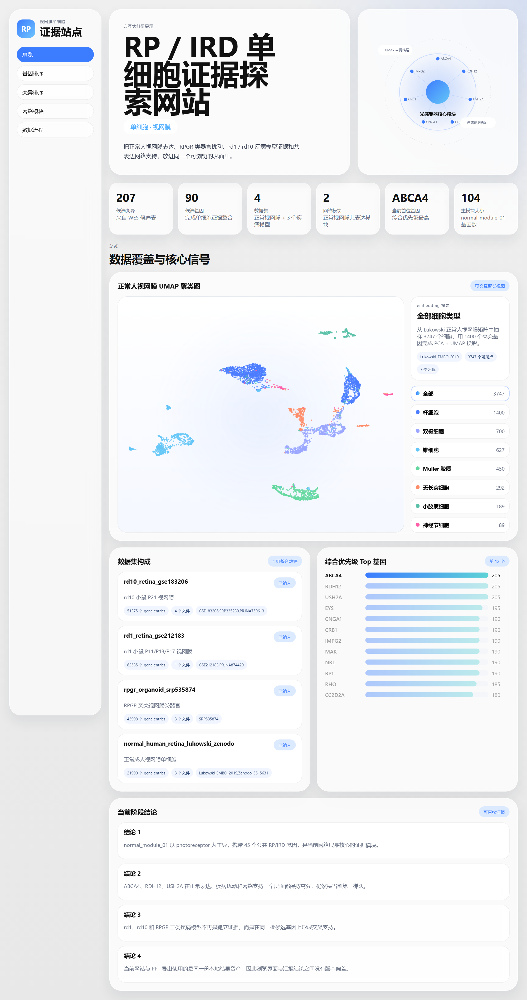
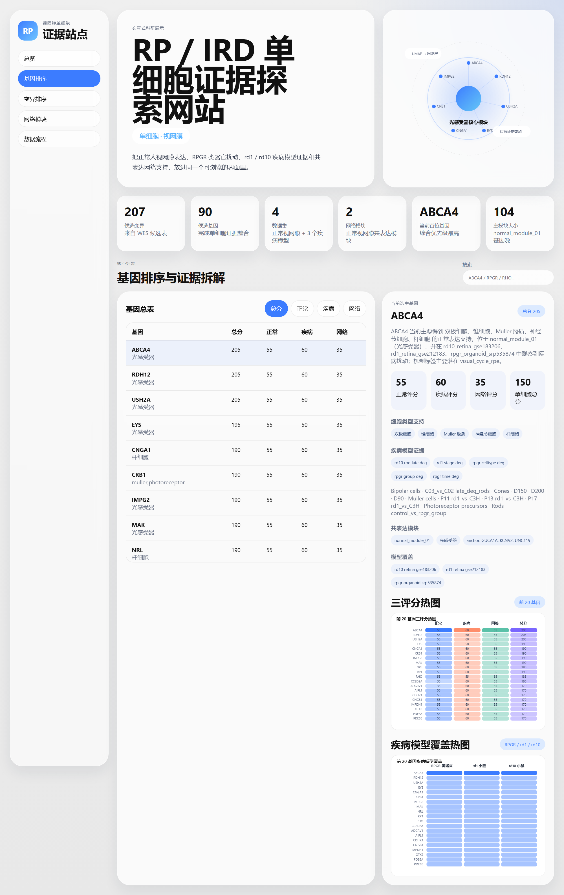
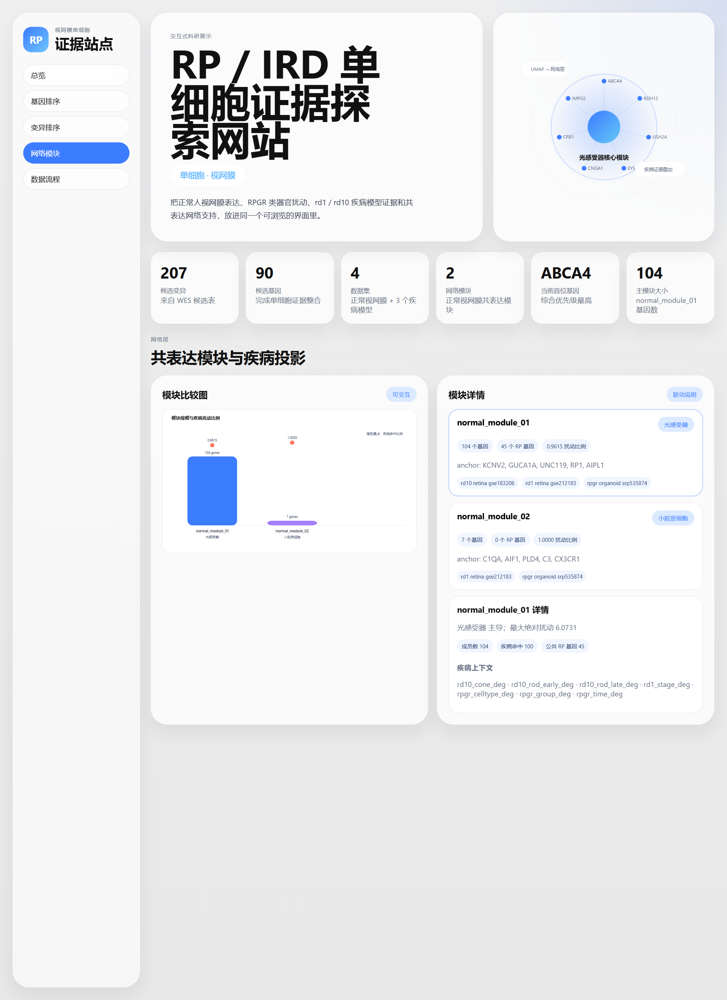
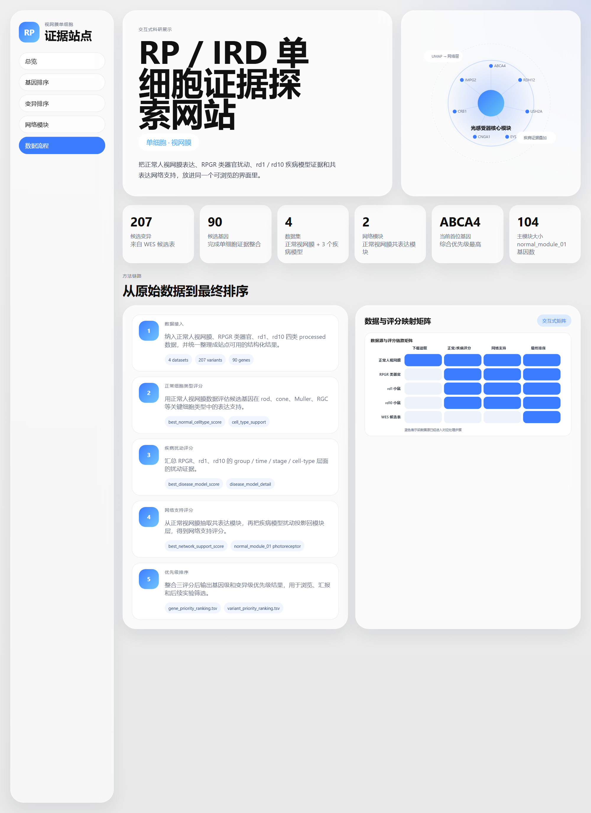

# WES 解释增强工具

这是一个面向 **WES 候选解释增强** 的本地 CLI 工具。  
它的目标不是替代标准 WES 主流水线，而是在候选变异初筛之后，把：

- 已知疾病基因证据
- 表型匹配证据
- 组织 / 单细胞表达证据
- 疾病模型扰动证据
- 共表达 / 网络支持证据

整合成统一的排序结果、报告摘要和交互式网站。

当前仓库已经把 **RP / IRD** 作为第一套示例 profile 跑通，但工具本身是按 **profile 驱动** 设计的，后续可以按同一 schema 扩展到其他疾病。

---

## 工具结构

当前这套工具链分成 3 层：

1. **标准 WES 主线**
   - 负责 FASTQ、比对、变异检测、基础注释
   - 现有脚本和流水线仍保留在仓库里

2. **解释增强层**
   - 读取候选变异 / 候选基因表
   - 读取疾病 profile 定义的数据清单与公共基因证据
   - 调用单细胞 / 疾病模型打分脚本
   - 输出排序结果与解释摘要

3. **展示层**
   - 从排序结果构建交互式网站
   - 供浏览、汇报和后续筛选使用

---

## 当前已经打通的示例 profile

### `rp_ird`

示例 profile 位于：

- `config/tool-profiles/rp_ird.json`

它当前整合的数据包括：

- 正常成人视网膜单细胞：`Lukowski_EMBO_2019`
- RPGR 突变视网膜类器官：`SRP535874`
- rd1 小鼠视网膜：`GSE212183`
- rd10 小鼠视网膜：`GSE183206`
- 候选输入：`config/wes/company-analysis-results.tsv`
- 公共已知基因：`PanelApp retinal disorders`

---

## CLI 用法

### 1. 查看 profile 配置

```bash
python -m wes_enhancer.cli show-profile --profile config/tool-profiles/rp_ird.json
```

### 2. 运行完整解释增强链路

```bash
python -m wes_enhancer.cli run --profile config/tool-profiles/rp_ird.json --build-site
```

这个命令会：

1. 读取 profile
2. 调用现有排序脚本生成结果
3. 输出运行摘要
4. 可选构建交互式网站

默认输出目录：

- `output/tool-runs/rp_ird_demo/`

### 3. 只从已有结果构建网站

```bash
python -m wes_enhancer.cli build-site ^
  --profile config/tool-profiles/rp_ird.json ^
  --results-dir output/tool-runs/rp_ird_demo/results ^
  --site-dir output/tool-runs/rp_ird_demo/wes-evidence-explorer
```

---

## 网站输出

当前网站是工具链的一个输出，而不是工具本体。

网站可展示：

- 正常视网膜 UMAP 聚类图
- 基因优先级排序
- 变异优先级排序
- 三评分热图
- 疾病模型覆盖热图
- 共表达模块与疾病投影
- 数据处理流程

示例入口：

- `site/rp-scrna-explorer/index.html`

或者运行后查看 profile 输出目录下的网站。

---

## 关键输出文件

一次完整运行后，核心结果包括：

- `gene_priority_ranking.tsv`：基因级优先级排序
- `variant_priority_ranking.tsv`：变异级优先级排序
- `evidence_breakdown.tsv`：证据拆解明细
- `network_module_summary.tsv`：网络模块汇总
- `summary.json`：结果摘要
- `run_report.md`：本次 CLI 运行摘要
- `run_summary.json`：本次 CLI 的结构化元信息
- 网站目录：交互式展示站点

---

## RP / IRD 示例中的三评分

当前示例 profile 的核心是 3 个解释增强评分：

1. **正常细胞类型评分**
   - 候选基因在正常人视网膜关键细胞类型中的表达支持

2. **疾病模型评分**
   - 候选基因在 RPGR / rd1 / rd10 模型中的扰动证据

3. **网络支持评分**
   - 正常视网膜共表达模块归属
   - 模块细胞类型主导关系
   - 模块在疾病模型中的整体扰动支持

---

## 当前目录里的关键脚本

### 解释增强排序

- `scripts/scrna-rp-rank.py`

负责：

- 读取 manifest
- 汇总正常表达支持
- 汇总疾病模型扰动支持
- 汇总网络模块支持
- 输出基因级和变异级排序

### 网站构建

- `scripts/build_scrna_explorer.py`

负责：

- 读取结果目录
- 生成站点所需数据资产
- 构建正常视网膜 UMAP 展示点
- 生成可直接打开的静态网站

### 工具 CLI

- `wes_enhancer/cli.py`

负责：

- 读取 profile
- 调用现有排序脚本
- 组织输出目录
- 生成运行摘要
- 触发网站构建

---

## NPM 快捷命令

### 构建网站

```bash
npm run scrna-site:build
```

### 本地预览网站

```bash
npm run scrna-site:serve
```

### 运行示例 profile

```bash
npm run wes-tool:demo
```

---

## 软件截图

### 总览页



### 基因排序页



### 网络模块页



### 数据流程页



---

## 依赖

Python 侧站点构建依赖：

```bash
pip install -r requirements-scrna-site.txt
```

---

## 设计说明

这套仓库当前采用的是 **“薄 CLI + 复用既有脚本 + profile 驱动”** 的结构，而不是重写全部分析逻辑。这样做的原因是：

- 现有 RP 结果链已经验证过
- 根因不在算法缺失，而在缺少统一工具入口
- 最短路径是把现有脚本收成一个可复用工具，而不是推倒重做

因此当前版本的重点是：

- 把工具链真正串起来
- 让网站成为标准输出之一
- 让新增疾病时只需要补 profile 和数据，而不是重写整套代码
